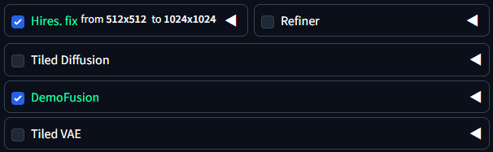

# Stable Diffusion web UI InputAccordion Highlight
Change the text color when an InputAccordion is enabled in [Stable Diffusion web UI](https://github.com/AUTOMATIC1111/stable-diffusion-webui) 

Color can be changed under `Setting > User interface > Custom InputAccordion enable highlight color`

